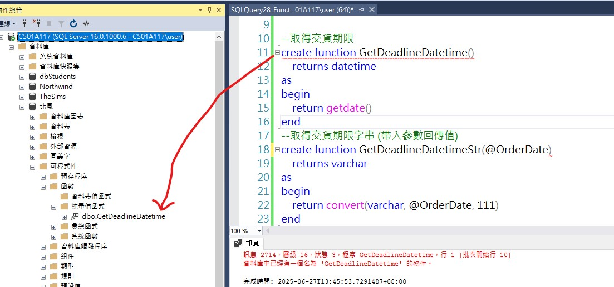

做資料庫update或delete時，須注意資料表的關聯性，例如訂單明細的訂單號碼關聯於訂單主檔，不可直接刪除訂單主檔(資料庫也不允許)，需先刪除訂單明細後再刪除訂單主檔；同理update也一樣。

# SQL指令類別
<ul>
    <li>DML：對資料本身做讀寫</li>
    <li>DDL：對資料庫物件作內容定義</li>
    <li>DCL：對資料庫做管理(權限、角色、連線)</li>
</ul>

---

<ul>
    <li>需求</li>
    <li>分析(SA)</li>
        <ul>
            <li>資料</li>
            <li>流程</li>
        </ul>
    <li>設計(SD)->規格->資料字典(其中一項實作資料庫)</li>
    <li>實作</li>
        <ul>
            <li>資料庫</li>
            <li>程式碼</li>
        </ul>
</ul>

# 變數定義
<ul>
    <li>nchar：固定長度字串，PK建議使用</li>
    <li>nvarchar：變動長度字串</li>
</ul>

Colume Level：針對欄位做描述
Table Level：針對資料表做描述

dbo：資料庫物件(Database Object)

# 建立自訂函數

執行成功後，會在資料庫內建立此Function  


當Function已建立後要修改，須把開頭的create改成alter

---

### MSSQL函數不允許具有副作用的操作（例如 `INSERT`、`UPDATE` 或 `DELETE`）
```sql
create function GetOrderID()
	returns nvarchar(12)
as
	begin

	insert into [dbo].[Orders](OrderID) values (@NewOrderID)

	return @NewOrderID
end
```
* **原因：**  
SQL Server 的函數設計是為了確保純粹性（無副作用），因此不允許執行修改資料的操作。

* **解決方法1：** 改用儲存程序  
將邏輯移至儲存程序，因為儲存程序允許執行副作用操作。

```sql
create procedure GetOrderID
```

* **解決方法2：** 函數僅返回值  
如果必須使用函數，請讓函數僅生成並返回 OrderID，而不執行 INSERT 操作。然後在外部執行 INSERT。

# 變數種類
1. 純量質變數 ：回傳值
2. 資料表值變數：回傳資料表

# 預存程序
預存程序：類似void

# 叢集

# 索引鍵與索引的不同
可以把資料庫的每個欄位都建立索引，但並不代表每個都需要或適合建立。e.g. 地址(文字多又鬆散)  
必要建立索引的時候：時常需要搜尋的條件  
以上所建立的索引都叫做非叢集索引

# 觸發程序的執行過程
insert into 貨運公司( 貨運公司名稱  , 電話 )  values(  '貨運'  , '(08)8210171' )

1. Trigger (Instead Trigger，如果有的話)\
其所做的動作會完全取代掉後續動作
自己定義要做的檢查，會先於內建檢查前執行
1. 內建檢查
    * PK
    * FK
    * Check(條件約束)
    * Default
    * Unique
    * Identity
2. 自訂檢查
    * Trigger (After Trigger)
3. 所有檢查都通過後才會執行"Commit"